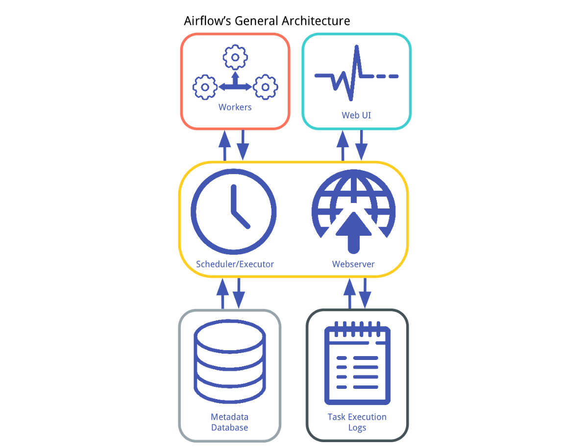

# Airflow Codebase Template

## Background

Apache Airflow is the leading orchestration tool for batch workloads. Originally conceived at Facebook and eventually open-sourced at AirBnB, Airflow allows you to define complex directed acyclic graphs (DAG) by writing simple Python. 

Airflow has a number of built-in concepts that make data engineering simple, including DAGs (which describe how to run a workflow) and Operators (which describe what actually gets done). See the Airflow documentation for more detail: https://airflow.apache.org/concepts.html 

Airflow also comes with its own architecture: a database to persist the state of DAGs and connections, a web server that supports the user-interface, and workers that are managed together by the scheduler and database. Logs persist both in flat files and the database, and Airflow can be setup to write remote logs (to S3 for example). Logs are viewable in the UI.

## A Note on managing Airflow dependencies

Airflow is tricky to install correctly because it is both an application and a library. Applications freeze their dependencies to ensure stability, while libraries leave their dependencies open for upgrades to take advantage of new features. Airflow is both, so it doesn't freeze dependencies. This means that depending on the day, a simple `pip install apache-airflow` is not guaranteed to produce a workable version of the Airflow application. 

To combat this, Airflow provides a set of [constraints files](https://airflow.apache.org/docs/apache-airflow/stable/installation.html#constraints-files) that are known working versions of Airflow. 

This template installs Airflow using the constraints file at `https://raw.githubusercontent.com/apache/airflow/constraints-${AIRFLOW_VERSION}/constraints-${PYTHON_VERSION}.txt` and allows for building a custom Airflow image on top of this constraints file by simply adding additional dependencies to `airflow.requirements.txt`. Local dependencies are added to `local-requirements.txt`. 

### Why not just use the [official docker-compose file](https://github.com/apache/airflow/blob/master/docs/apache-airflow/start/docker-compose.yaml)?

It's easier to customize our additional dependencies with Airflow by building our own image. The master Airflow image doesn't allow this kind of low-level control. 

This template is particularly useful to Airflow power users that tend to write a lot of custom plugins or functionality using external dependencies. 

### Why not just extend off of the [official Airflow image](https://airflow.apache.org/docs/apache-airflow/stable/production-deployment.html#production-container-images)?

You can do this, but customizing the image yields far more optimizations, and doesn't come with any additional complexity. To add Airflow extras, you can simply add it to the `AIRFLOW_EXTRAS` variable in the Makefile:

        AIRFLOW_EXTRAS := postgres,google

To install any other pip dependencies, simply add it to `airflow.requirements.txt`.

## Getting Started

This repository was created with `Python 3.8.6`, but should work for all versions of Python 3. 

DAGs should be developed & tested locally first, before being promoted to a development environment for integration testing. Once DAGs are successful in the lower environments, they can be promoted to production. 

Code is contributed either in `dags`, a directory that houses all Airflow DAG configuration files, or `plugins`, a directory that houses Python objects that can be used to extend Airflow.

### Running Airflow locally

This project uses a Makefile to consolidate common commands and make it easy for anyone to get started. To run Airflow locally, simply:

        make start-airflow

This command will build your local Airflow image and start Airflow automatically!

Navigate to http://localhost:8080/ and start writing & testing your DAGs! Login with the user-password combo: `admin:admin` (you can change this in `docker-compose.yaml`).

You'll notice in `docker-compose.yaml` that both DAGs and plugins are mounted as volumes. This means once Airflow is started, any changes to your code will be quickly synced to the webserver and scheduler. You shouldn't have to restart the Airflow instance during a period of development! 

When you're done, simply:

        make stop-airflow

### Testing & Linting

Instantiating a local virtual environment is now entirely optional. You can develop entirely through Docker, as Airflow runs inside of docker-compose and `test-docker` and `lint-docker` provide avenues for running those steps without a virtual environment. 

However, not using a virtual environment also means sacrificing any linting/language-server functionality provided by your IDE. To setup your virtual environment:

        make  venv

This project is also fully linted with black and pylint, even using a cool pylint plugin called [pylint-airflow](https://pypi.org/project/pylint-airflow/). To run linting:

With your virtual environment: 

        make lint

With Docker:

        make lint-docker

Any tests can be placed under `tests`, we've already included a few unit tests for validating all of your DAGs and plugins to make sure they're valid to install in Airflow. To run tests:

With your virtual environment:

        make test

Inside Docker:
        
        make test-docker

### Cleaning up your local environment

If at any point you simply want to clean up or reset your local environment, you can run the following commands:

Reset your local docker-compose:

        make reset-airflow

Rebuild the local Airflow image for docker-compose (useful if you make changes to the Dockerfile):
        
        make rebuild-airflow

Clean up Pytest artifacts:
        
        make clean-pytest

Reset your virtual environment:

        make clean-venv

Start completely from scratch:

        make clean-all

### Deployment

Once you've written your DAGs, the next step is to deploy them to your Airflow instance. This is a matter of syncing the `dags` and `plugins` directories to their respective destinations. 

TODO: add some examples and documentation of deployments to different Airflow cloud providers (Astronomer, Cloud Composer, etc.) using different CI technologies (CircleCI, Github Actions, etc.)
